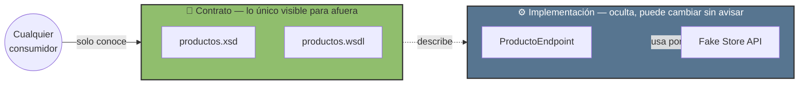
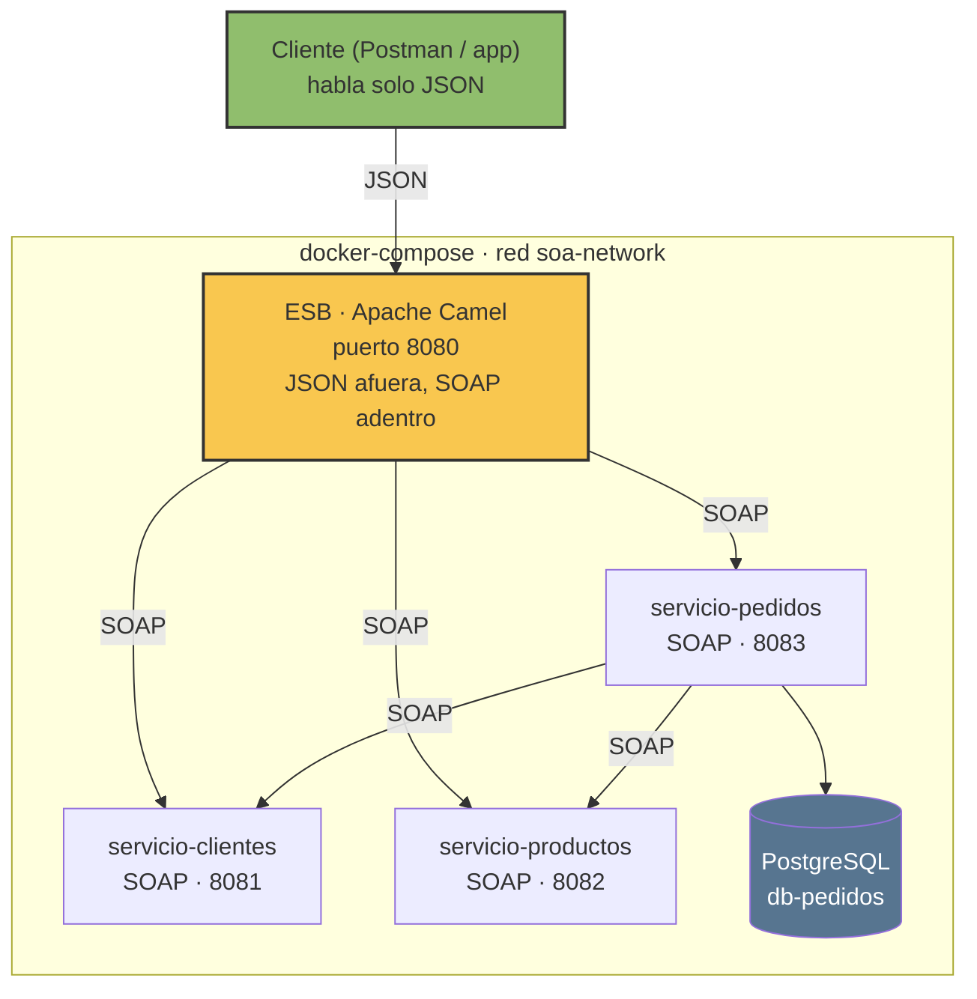
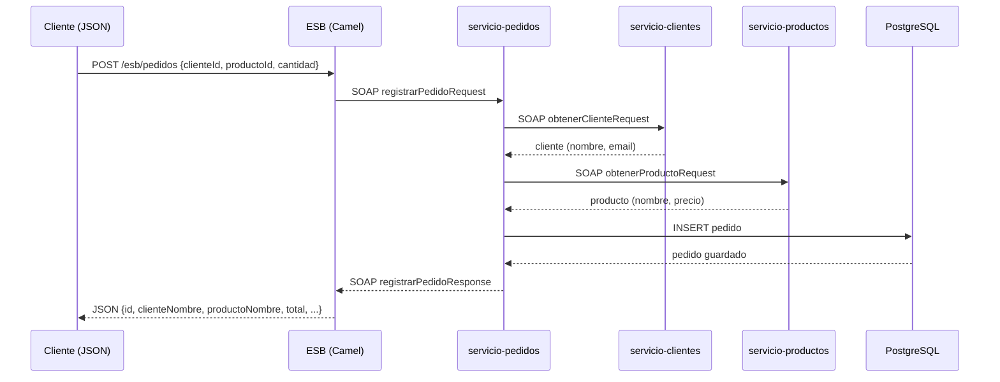

# Tarea 2 — Infraestructura SOA con ESB

Infraestructura de arquitectura **SOA**: 3 servicios SOAP con contrato propio
(WSDL/XSD), registrados y enrutados por un **ESB** (Apache Camel), con un
servicio persistiendo en PostgreSQL bajo **Clean Architecture**. De cara al
cliente final, todo se consume en JSON — el ESB es quien traduce a SOAP por
dentro.

---

## 🗺️ Mapa rápido

| Componente | Puerto | Habla | Rol |
|---|---|---|---|
| `servicio-clientes` | 8081 | SOAP | Datos de clientes (randomuser.me) |
| `servicio-productos` | 8082 | SOAP | Datos de productos (Fake Store API) |
| `servicio-pedidos` | 8083 | SOAP | Registra/lista pedidos · PostgreSQL |
| `db-pedidos` | 5432 (interno) | PostgreSQL | Persistencia de pedidos |
| `esb-camel` | 8080 | REST/JSON ↔ SOAP | El **bus**: traduce y enruta a los 3 servicios |

---

## 🔗 URLs para probar

| # | URL | Qué hace |
|---|---|---|
| 1 | `http://localhost:8081/ws/clientes.wsdl` | Contrato de `servicio-clientes` — confirma que está arriba y muestra su WSDL |
| 2 | `http://localhost:8082/ws/productos.wsdl` | Contrato de `servicio-productos` |
| 3 | `http://localhost:8083/ws/pedidos.wsdl` | Contrato de `servicio-pedidos` |
| 4 | `http://localhost:8080/swagger-ui/index.html` | **ESB** — el único que se puede probar 100% desde el navegador (botón "Try it out", sin Postman) |

> Los WSDL (1, 2, 3) se pueden **ver** en el navegador para confirmar que el
> servicio está corriendo y revisar su contrato, pero **invocar** una
> operación SOAP sí requiere un cliente (Postman en modo SOAP, SoapUI, o el
> propio ESB). El único que de verdad se "ejecuta" desde el navegador es el
> ESB (4), porque habla JSON.

---

## ▶️ Cómo levantarlo

```bash
cd tarea2-soa
docker compose up --build
```

Luego entra a `http://localhost:8080/swagger-ui/index.html` y prueba
`GET /esb/clientes`, `GET /esb/productos` o `POST /esb/pedidos`.

> Los contenedores necesitan salida a internet para llegar a randomuser.me y
> Fake Store API. Con Docker Desktop por defecto ya la tienen.

---

## 🧩 Cómo se relaciona esto con arquitectura SOA

SOA no es "usar SOAP" — es un conjunto de principios de diseño. Esta tabla
conecta cada uno con una pieza concreta de este proyecto:

| Principio SOA | Dónde se ve aquí |
|---|---|
| **Contrato estandarizado** | Cada servicio nace de un XSD/WSDL (`clientes.xsd`, `productos.xsd`, `pedidos.xsd`) escrito **antes** que el código (contract-first) |
| **Acoplamiento débil** | Los servicios solo se conocen por su contrato XML. `servicio-pedidos` nunca sabe que `servicio-clientes` usa randomuser.me por dentro |
| **Abstracción** | El WSDL expone *qué* operación existe, no *cómo* está implementada — la API externa, el cálculo del total, todo queda oculto detrás del contrato |
| **Reutilización** | `servicio-clientes` y `servicio-productos` no son de uso exclusivo del ESB: `servicio-pedidos` también los consume directamente |
| **Autonomía** | Cada servicio vive en su propio contenedor, con su propio ciclo de vida; `servicio-pedidos` además tiene su propia base de datos |
| **Composición de servicios** | `servicio-pedidos` combina respuestas de `servicio-clientes` + `servicio-productos` para construir un pedido completo |
| **Sin estado** | Cada llamada SOAP es independiente; ninguna operación depende de una sesión previa |
| **Descubribilidad** | El WSDL describe operaciones, parámetros y tipos sin necesidad de leer el código fuente |
| **Mediación centralizada (ESB)** | El bus traduce protocolo (JSON↔SOAP), enruta y agrega respuestas — el cliente final nunca necesita saber que SOAP existe |

**Contrato vs. implementación — la idea que sostiene todo lo anterior:**



Si mañana `servicio-productos` deja de usar Fake Store API y pasa a leer de
una base de datos propia, **nada de afuera se entera** — el contrato
(`productos.xsd`/`productos.wsdl`) no cambia. Esa es la garantía que da SOA.

---

## 🛠️ Detalle de cada componente

### `servicio-clientes` (8081)
SOAP contract-first. Consume [randomuser.me](https://randomuser.me) usando
el `id` recibido como *seed*, así el mismo id siempre devuelve la misma
persona simulada (resultados repetibles). Si la API externa falla, cae a
datos quemados para no romperse.

### `servicio-productos` (8082)
Mismo patrón, consume [Fake Store API](https://fakestoreapi.com)
(`GET /products/{id}`). Ids válidos: **1 al 20**. Mismo respaldo ante
fallos de la API externa.

### `servicio-pedidos` (8083) + `db-pedidos` (PostgreSQL)
El servicio con lógica real


Dos operaciones:
- **`registrarPedido`** — recibe `clienteId`, `productoId`, `cantidad`. El
  caso de uso consulta `servicio-clientes` y `servicio-productos`
  (composición de servicios) para enriquecer los datos, calcula el total
  dentro del objeto de dominio, y un adaptador de infraestructura guarda en
  Postgres. Si alguno de los otros dos servicios no responde, igual se
  registra el pedido marcando el dato como "no verificado".
- **`listarPedidos`** — devuelve todos los pedidos ya guardados.

### `esb-camel` (8080) — el bus
De cara al cliente, **todo es JSON**; por dentro sigue hablando SOAP con los
3 servicios:

| Endpoint | Qué hace |
|---|---|
| `GET /esb/clientes` | Lista 10 clientes de ejemplo (ids 1-10) |
| `GET /esb/clientes/{id}` | Un cliente puntual |
| `GET /esb/productos` | Lista 10 productos de ejemplo (ids 1-10) |
| `GET /esb/productos/{id}` | Un producto puntual |
| `GET /esb/pedidos` | Lista todos los pedidos registrados |
| `POST /esb/pedidos` | Registra uno nuevo — body `{"clienteId": 1, "productoId": 5, "cantidad": 2}` |

El cliente final nunca llama directo a los puertos 8081/8082/8083 — solo
conoce el ESB. Las rutas y el "registro" de cada servicio viven en
`EsbRoutes.java`. Tiene manejo de errores centralizado (si un servicio
interno falla, el ESB responde con JSON explicando el problema en vez de
un 500 vacío) — eso también es trabajo típico de un ESB: aislar al cliente
de los fallos internos.

**Documentación interactiva (OpenAPI/Swagger):** Camel genera el documento
OpenAPI automáticamente a partir de las rutas REST.
- Spec JSON: `http://localhost:8080/api-doc`
- Swagger UI: `http://localhost:8080/swagger-ui/index.html`

> El WSDL de cada servicio SOAP sigue siendo su propio contrato — OpenAPI
> documenta el ESB porque es la única pieza que habla REST/JSON; SOAP se
> documenta con WSDL, no con OpenAPI.

---

## 📊 Diagramas

### Arquitectura general


### Secuencia: registrar un pedido (composición de servicios)



# cliente-app

Frontend SOA que consume **únicamente** el ESB. Nunca llama directo a los servicios SOAP.

## Flujo de red

```
Browser
  │  GET /api/clientes
  ▼
cliente-app :3000   (Express proxy)
  │  reescribe → GET /esb/clientes
  ▼
esb-camel :8080     (Apache Camel)
  │  SOAP/XML
  ▼
servicio-clientes :8081
```

## Endpoints que expone

| Ruta cliente-app | Reescrito a ESB        | Método | Descripción           |
|------------------|------------------------|--------|-----------------------|
| /api/clientes    | /esb/clientes          | GET    | Lista de clientes     |
| /api/clientes/:id| /esb/clientes/:id      | GET    | Cliente por ID        |
| /api/productos   | /esb/productos         | GET    | Catálogo de productos |
| /api/productos/:id| /esb/productos/:id    | GET    | Producto por ID       |
| /api/pedidos     | /esb/pedidos           | GET    | Lista pedidos         |
| /api/pedidos     | /esb/pedidos           | POST   | Crear pedido          |

## Levantar

### Con Docker Compose (recomendado)

Copia el contenido de `docker-compose.fragment.yml` a tu `docker-compose.yml` principal:

```bash
docker compose up --build cliente-app
```

Acceder en: http://localhost:3000

### En local (desarrollo)

```bash
cd cliente-app
npm install

# Apuntar al ESB local
ESB_URL=http://localhost:8080 npm run dev
```

## Variables de entorno

| Variable  | Default             | Descripción                                |
|-----------|---------------------|--------------------------------------------|
| `PORT`    | 3000                | Puerto del servidor Express                |
| `ESB_URL` | http://esb:8080     | URL del ESB  |


