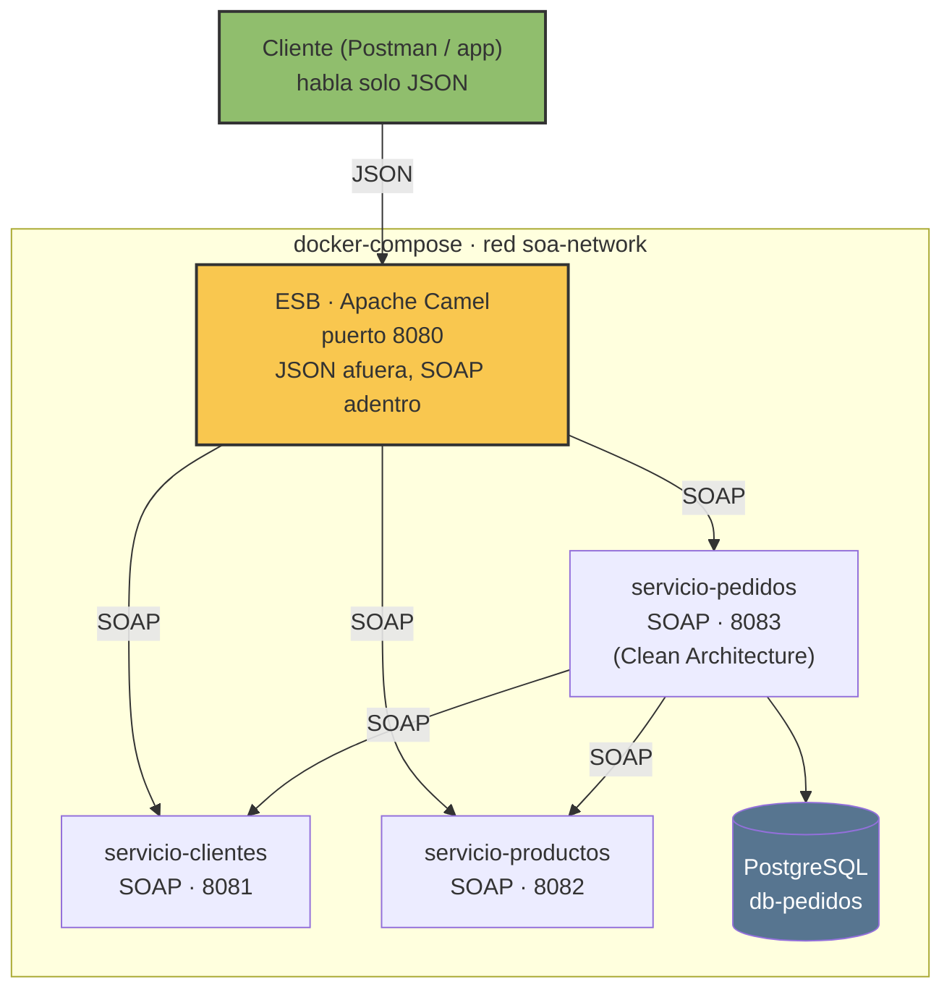
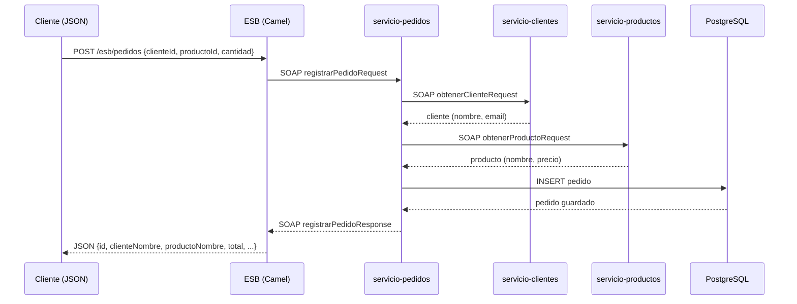

# Tarea 2 — Infraestructura SOA con ESB

## Qué hay armado ahora
- `servicio-clientes` (puerto 8081): servicio SOAP contract-first, consume
  [randomuser.me](https://randomuser.me) para simular personas (nombre, email),
  usando el `id` como seed para resultados repetibles.
- `servicio-productos` (puerto 8082): mismo patrón, consume
  [Fake Store API](https://fakestoreapi.com) (`GET /products/{id}`) para traer
  productos reales (nombre, categoría, precio). Ids válidos: **1 al 20**.
  WSDL en `http://localhost:8082/ws/productos.wsdl`.
- Ambos caen a datos quemados si la API externa falla, para que el servicio
  nunca se rompa.
- `esb-camel` (puerto 8080): el **bus**, hecho con Apache Camel. De cara al
  cliente, **todo es JSON** — por dentro sigue traduciendo a SOAP para
  hablar con cada servicio:
  - `GET http://localhost:8080/esb/clientes` → lista 10 clientes de ejemplo (ids 1-10)
  - `GET http://localhost:8080/esb/clientes/{id}`
  - `GET http://localhost:8080/esb/productos` → lista 10 productos de ejemplo (ids 1-10)
  - `GET http://localhost:8080/esb/productos/{id}`
  - `GET http://localhost:8080/esb/pedidos` → lista todos los pedidos
  - `POST http://localhost:8080/esb/pedidos` con body
    `{"clienteId": 1, "productoId": 5, "cantidad": 2}` → registra uno nuevo

  El cliente final (Postman, o luego `cliente-app`) solo necesita conocer
  estas URLs del ESB — nunca llama directo a los puertos 8081/8082/8083.
  Las rutas y el "registro" de cada servicio están en `EsbRoutes.java`.

  **Documentación interactiva (OpenAPI/Swagger):** Camel genera el
  documento OpenAPI automáticamente a partir de las rutas REST.
  - Spec JSON: `http://localhost:8080/api-doc`
  - Swagger UI (para explorar y probar desde el navegador):
    `http://localhost:8080/swagger-ui/index.html`

  Nota: el WSDL de cada servicio SOAP (`servicio-clientes`,
  `servicio-productos`, `servicio-pedidos`) sigue siendo su propio
  contrato — OpenAPI documenta el ESB porque es la única pieza que
  habla REST/JSON; SOAP se documenta con WSDL, no con OpenAPI.
- `servicio-pedidos` (puerto 8083) + `db-pedidos` (PostgreSQL): el tercer
  servicio del contrato, con persistencia real y **Clean Architecture**
  (puertos y adaptadores):
  ```
  domain/          → Pedido, ClienteInfo, ProductoInfo (Java puro, sin Spring/JPA)
  application/      → RegistrarPedidoUseCase, ListarPedidosUseCase
    port/           → interfaces: PedidoRepositoryPort, ClienteGatewayPort, ProductoGatewayPort
  infrastructure/
    soap/           → PedidoEndpoint (solo traduce) + adaptadores SOAP que implementan los ports
    persistence/    → PedidoJpaEntity + adaptador que implementa PedidoRepositoryPort
    config/         → WSDL y RestTemplate
  contract/         → generado por JAXB a partir de pedidos.xsd (no se edita a mano)
  ```
  Dos operaciones SOAP:
  - `registrarPedido` — recibe `clienteId`, `productoId`, `cantidad`. El caso
    de uso llama a los puertos `ClienteGatewayPort`/`ProductoGatewayPort`
    (composición de servicios SOA) para enriquecer los datos, calcula el
    total dentro del objeto de dominio, y los adaptadores de infraestructura
    se encargan de guardar en Postgres.
  - `listarPedidos` — devuelve todos los pedidos ya guardados.

  WSDL en `http://localhost:8083/ws/pedidos.wsdl`. Si `servicio-clientes` o
  `servicio-productos` no responden al registrar, igual se guarda el pedido
  marcando el dato como "no verificado" en vez de fallar todo.
- `docker-compose.yml`: ya construye y levanta los cinco contenedores
  (3 servicios + Postgres + ESB), en el orden correcto (Postgres espera a
  estar realmente listo — `healthcheck` — antes de que arranque `servicio-pedidos`).

> Nota: los contenedores necesitan salida a internet para llegar a las APIs
> externas. Con Docker Desktop por defecto ya la tienen, no hace falta
> configurar nada extra.

## Cómo probarlo
```bash
docker compose up --build
```
Luego abre en el navegador:
```
http://localhost:8081/ws/clientes.wsdl
```
Para probar la operación puedes usar SoapUI, Postman (modo SOAP) o un cliente
generado con `wsimport`/`cxf-codegen` apuntando a ese WSDL.

## Próximos pasos (en orden)

1. **Construir `cliente-app`**: una app simple que llame solo al ESB
   (`http://esb:8080/esb/...` dentro de la red Docker), nunca directo a los
   servicios.
2. **Descomentar** `cliente-app` en el compose y levantar todo junto.

## Diagramas

### Arquitectura general


### Secuencia: registrar un pedido (composición de servicios)


### Capas de servicio-pedidos (Clean Architecture)
```mermaid
flowchart LR
    subgraph Infraestructura
        EP[PedidoEndpoint]
        CA[ClienteSoapAdapter]
        PA[ProductoSoapAdapter]
        RA[PedidoRepositoryAdapter]
    end
    subgraph Aplicación
        UC1[RegistrarPedidoUseCase]
        UC2[ListarPedidosUseCase]
        Port1(["ClienteGatewayPort"])
        Port2(["ProductoGatewayPort"])
        Port3(["PedidoRepositoryPort"])
    end
    subgraph Dominio
        Pedido
    end

    EP --> UC1
    EP --> UC2
    UC1 --> Port1
    UC1 --> Port2
    UC1 --> Port3
    UC1 --> Pedido
    CA -.implementa.-> Port1
    PA -.implementa.-> Port2
    RA -.implementa.-> Port3


docker-compose down (o docker compose down)

Busca un archivo docker-compose.yml en la carpeta donde estás parada y, si lo encuentra, detiene y borra todo lo que ese archivo define: los contenedores, la red (soa-network), pero no los volúmenes (a menos que agregues -v). 


```

